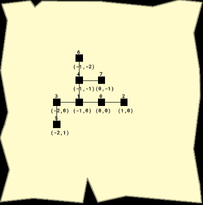
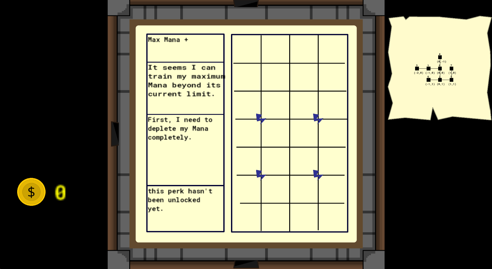

This file serves as a technical explanation of the more complex systems of Heavy Weather.

### The short explanation of key systems:
* **Room Generation:** After clicking 'start', a list of rooms is generated as structs alongside their connections and special rooms. Moving between rooms changes which struct is accessed.
* **Perks:** Perks are created as structs holding stat changes, requirements, and abilities. Updates on perk availability are checked constantly; when one is available, it's marked until it is unlocked.
* **Items:** Items are also structs including stat changes and abilities. Dropped items use a generic 'item' object that references the item's sprite and ID for retrieval.
* **Enemy Formations:** Enemy formations are picked from a pool of 2 difficulties depending on which stage of the floor you're on. Each enemy's location is stored in regards to the center of the room; when loaded, it simply calculates which way to orient the formation.

### Detailed Explanation:

#### Room Generation:
* Each room is defined as a struct containing identifying and gameplay information such as:
  * Rooms ID
  * Width and height
  * Location in a grid
  * North, East, South, West connections, or if there is nothing there.
  * The enemy formation inside the room.
  * Background
  * Gameplay variables such as cleared, visited, or type of room.
* Using this struct, the generator places the starting room at `0,0` with an ID of `0` in the array and starts the creation loop.
  * This loop holds an algorithm which ends after creating a random amount of rooms, dependent on which part the player is on.
  * Using a random room from the array as a base, the algorithm picks a random direction and checks for occupation:
    * **If occupied:** The algorithm continues without creating a new room, not incrementing the loop.
    * **Else:** The prospective room is created and records the connection with the base room and new room, incrementing the loop.
* After the array is populated, leftover room artifacts are cleared and certain rooms are picked for special properties:
  * **Room ID 0** (starting room, center of map) is set as the `START` room, removing any enemies in it.
  * The dead-end room physically closest, or one of the closest, is set as the `TREASURE` room, holding unique scenery and the Chest object.
  * The dead-end room physically farthest, or one of the farthest, is set as the `TRADE` room, holding a trader and the next part of the tower.
* Afterward, the player is brought into the `START` room.
  * **HOWEVER**, if the player has already passed the first 2 parts, room generation is overridden and the room list is manually populated with the `PASSAGE` and `BOSS` rooms.
* After creation, the generator persists and draws out the map on the HUD, defining room connections and coordinates.

Fun fact: the map display was initially used for playtesting and debugging, but playtesters found it to be too helpful to remove. Thus, it was given its own place in your arsenal.

#### Room movement:
* Starting at Room 0, movements are initiated by Door objects.
  * Doors are locked if enemy count is above 0.
* After contact with an open door, the floor controller's fade effect is set to `FADING OUT` and player and enemies are frozen:
  * When the fade effect reaches 1 (max opaque), the floor generator checks what object called it.
    * `DOOR:` the next room is accessed
    * `LADDER:` the room list is cleared, part is increased, and a new map is generated
    * `BOSS DOOR:` the room list is cleared, and the boss segment loads in place of a map
* During the `DOOR` fade, the current room is unloaded and
  * the background is set to the new room's background (important for special rooms)
  * The correct wall-barriers and doors are loaded
  * Camera, player positioning, and special objects are loaded.
  * Using the room's 'contents' variable, certain actions are taken
    * `COMBAT:` enemies are loaded (only on specifically combat rooms)
    * `TREASURE` & `TRADER` both heal the player
    * `BOSS:` loads the boss
    * After which, housekeeping such as refilling items, setting `visited` to true, and setting fade to `FADING IN`.
* After the fade in is completed, player and enemies are unfrozen, completing the movement.

#### Perks and Items:
* Both items and perks are fairly similar, being stored as structs containing stat changes, abilities, names, and respective IDs for both systems.
* Items:
  * Item IDs refer to the items enumeration, ensuring the system can be easily expanded upon.
  * Items must be found in `CHEST` or `TRADER` objects, and don't have requirements to use.
  * When an item is picked up, it calls a function to adjust the player's stats and activate its ability.
  * Items have 2 abilities. if the player presses space while its animation is still active, the secondary ability is used instead.
  * If an item is dropped, its stat changes are removed.
  * Items on the ground use a generic `item` object, holding which item it refers to and the sprite of that item.
  * Item trading, buying, or selling can be done at `TRADER` NPCs.
* Perks:
 * Perk IDs act similar to item IDs, referring to the perks enumeration.
 * Perks can be unlocked in the perk menu after its specific requirements have been met, signified by the 'paper' sound after availability opens.
 * Hovering over the perks icon in the perk menu displays its name, a short description, its requirements, and its availability `LOCKED`, `AVAILABLE`, `UNLOCKED`.
 * Perk availability is checked constantly by a function, assessing if both a perk's requirements are met and if it's still `LOCKED`.

#### Enemy Formations:
* Each enemy is placed in a 'pool', defining what characteristic it has, such as `light`, `ranged`, `heavy`, or `special`.
* The formation is recorded as an array of structs, each containing an enemy role and its position relative to the center.
 * When enemy role is called, it refers to its characteristic pool, pulling an enemy from it. This maintains variety while still keeping defined challenges for each room.
 * Enemy position is dependent on which direction the player enters from, transforming its coordinates accordingly.
   * `NORTH:` x = -relativeX, y = -relativeY
   * `EAST:` x = relativeY, y = -relativeX
   * `SOUTH:` x = relativeX, y = relativeY
   * `WEST:` x = -relativeY, y = relativeX

#### Boss Design:
* The demon Baal serves as the final roadblock for the demo, utilizing storm and lightning attacks like the player.
* Baal is given 3 different attacks to represent the floor: lightning 'jabs', storm 'zoning', and physical 'rushdowns'.
 * Jabs summon several choreographed lightning strikes at the players position, forcing movement.
 * Zoning fires a large thunderstorm at the player and leaves lingering thunder in its wake, restricting the playspace.
 * Rush-downs pressure the player into focusing on evasion, forcing the player to use different moves and emphasizing the need for speed upgrades.
* After each move, Baal randomly chooses from a list of moves, with his most recent move occuring at a lower chance than others. This provides a sense of variety while retaining simulated "frustration" from Baal.
* This frustration is highlighted when Baal is brought down to less than half health, in which his 2-second cooldown between attacks is disabled, forcing the player to deal with the constant pressure of jabs, rushes, and zoning.
* After Baal's death, the exit door is spawned, releasing the player from the tower (for now).

#### Development Challenges:
* Procedural generation:
 * Eventually, I settled on the design described in `ROOM GENERATION` seen above, creating an initial list, then picking certain dead-ends to reward or progress the player.
 * This proved one of the most difficult hurdles to the first demo, as it required needing an start, treasure room, and exit while retaining playability and avoiding major flaws such as overlapping rooms or missing connections.
 * The room struct proved to be the most valuable addition to this system, and sort of inspired other struct-focused systems. The ability to check ID, location, and connections from one item streamlined the generation process.
 * Loops would be necessary, no doubt, but my initial design revolved around the loop running a certain number of times and simply using whatever came out. But going over it again revealed a much more controlled approach in simply not incrementing if there is a room there.

* Camera and visuals:
 * A common problem I had while designing an implementing special rooms was updating the background and camera viewport.
  * The background was preset as the basic room design and struggled to adjust to the smaller treasure and passage rooms. the solution found was to redraw the background below everything upon entering each room.
  * The camera wouldn't adjust to rooms with separate parameters, leading to the play-space being stretched or pushed to the corner of the viewport. Like the background, the camera is set to adjust to the room's width and height properties.
 * In prior versions, the health, mana, and item displays were placed inside the viewport, obstructing enemies or key gameplay visuals. Eventually, experimentation with GUI elements expanded possibilities of the interface, providing a natural solution to a common testing issue.

* Attacks and the combat system:
 * Initial versions of the base surge and lightning attacks revealed problems.
  * The Surge, intended to be a crowd-controlling, low-damage projectile, only hit one enemy at a time. The initial code was scrapped in favor of chipping damage that hits the enemy constantly.
  * Lightning Bolts, the precision range attack, summoned a solid sprite and hit the furthest enemy from its start (for some reason). Thus it was changed to be an invisible projectile that stretched the sprite from its point of fire, then destroys itself on collision.
 * For a while, the Player's main attacks remained the base surge cloud and lightning bolt, however the architecture proved troublesome when implementing the free-form lightning bolt (Thunderstruck) and close range shock (It Be Nice).
  * Eventually, the final attack decision was moved to an `attacks` function, receiving both the players charge level and which attack type to use. This simplified the Player code and gave room for expansion, while also providing a clean interaction for the perk attacks.
